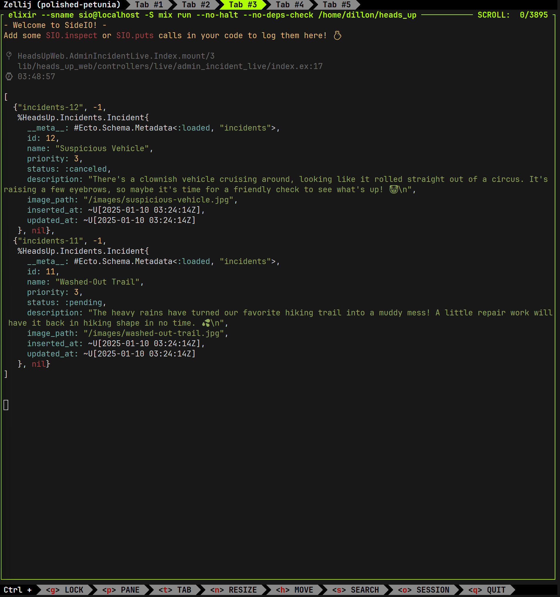

# SIO (SideIO)

**SIO** is an Elixir package that allows you to redirect logs
that would typically go to `stdout` into a separate terminal
tab. This is useful for keeping your primary terminal output
clean and organized, while still being able to view logs in a
dedicated tab for debugging or monitoring purposes.

With **SIO**, you can easily manage log visibility across
different tabs, streamlining your development workflow.

## Screenshots
| Standard Logging | SIO Logging |
|------------------|-------------|
|   |   |

## Installation

1. Add SIO to your deps in `mix.exs`:
`{:sio, github: "dillonoconnor/sio", only: :dev}`

2. Add the `sio_start` alias to PATH:

**Bash**:

```
echo "alias sio_start='elixir --sname sio@localhost -S mix run --no-halt --no-deps-check'" >> ~/.bashrc
```

**Fish**:

```
echo "alias sio_start='elixir --sname sio@localhost -S mix run --no-halt --no-deps-check'" >> ~/.config/fish/config.fish
```

**Zsh**:

```
echo "alias sio_start='elixir --sname sio@localhost -S mix run --no-halt --no-deps-check'" >> ~/.zshrc
```

Then, restart your terminal or run `source ~/.{YOUR_CONFIG_FILE_AS_ABOVE}` to make the command available.

## Usage

1. Start SIO on one tab: `sio start`

1. Start your main app on another tab (any name): `elixir --sname main@localhost -S mix phx.server`

3. Use SIO just like you would the regular IO functions:

```elixir
SIO.inspect(object)
# OR
SIO.puts(message)
```
